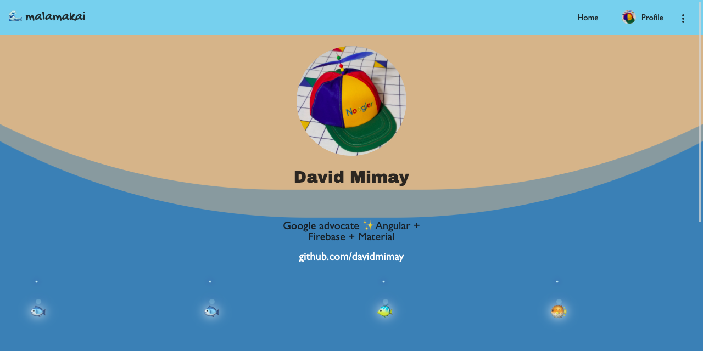

# malamakai

malamakai is an Angular PWA powered by Firebase.

- [Live Demo](https://malamakai.wep.app/)



## Features

- Angular 9.x + Firebase
- Installable PWA
- OAuth and Email/Password Signup with Firebase
- Drag & drop Kanban demo with Firestore

## Usage

1.  Run

- `git clone https://github.com/davidmimay/malamakai.git malamakai`
- `cd malamakai`
- `npm install`

2.  Create a project at https://firebase.google.com/ and grab your web config:


3.  Add the config to your Angular environment

#### src/environments/

Update the `environment.prod.ts` and `environment.ts` files. 

```typescript
export const environment = {
  production: false,
  firebase: {
    apiKey: 'APIKEY',
    authDomain: 'DEV-APP.firebaseapp.com',
    databaseURL: 'https://DEV-APP.firebaseio.com',
    projectId: 'DEV-APP',
    storageBucket: 'DEV-APP.appspot.com',
    messagingSenderId: '...',
    appId: '...',
  }
};
```

5.  Run `ng serve`

## Resources

- [Complete implementation with roles](https://docs.react2025.com/payments/checkout)
- [Delete users implementation](https://firebase.google.com/codelabs/stripe-firebase-extensions)
- [Delete users more info](https://firebase.google.com/docs/auth/web/manage-users#delete_a_user)
- [Custom claims](https://firebase.google.com/docs/auth/admin/custom-claims)
- [Stripe roles answers](https://stackoverflow.com/questions/64994680/firestore-rules-are-not-accepting-custom-claims-from-stripe-striperole)

- [Project 1](https://github.dev/stripe-samples/firebase-subscription-payments)
- [Project 2](https://github.dev/DJKullas/MacroRecipes/blob/81ad0ce92f12f6edbc2e2e49fda45318c1de14c6/src/app/profile/profile.component.ts)
- [Project 3](https://github.dev/Seifobeid2020/FrontendSeminar.V5)
- [Project 4](https://github.dev/luccagalhato/Dashboard-Angular/blob/3454f008016d0ae6a929cc350a676536e70d0963/src/app/on-boarding/payment/payment.component.ts)

- [Blogger API](https://developers.google.com/blogger/docs/3.0/)
- [Blogger implementation](https://github.dev/virgosama/jhotwheels-v2/blob/c5ca94d6d12965c139b09556026fb06496ea0312/src/app/blogger.service.ts)


## Developing

🟠 Blog
🟠 Blog Table of Content [Source1](https://www.npmjs.com/package/generatoc), [source2](https://webdevtrick.com/dynamic-table-of-contents/)
